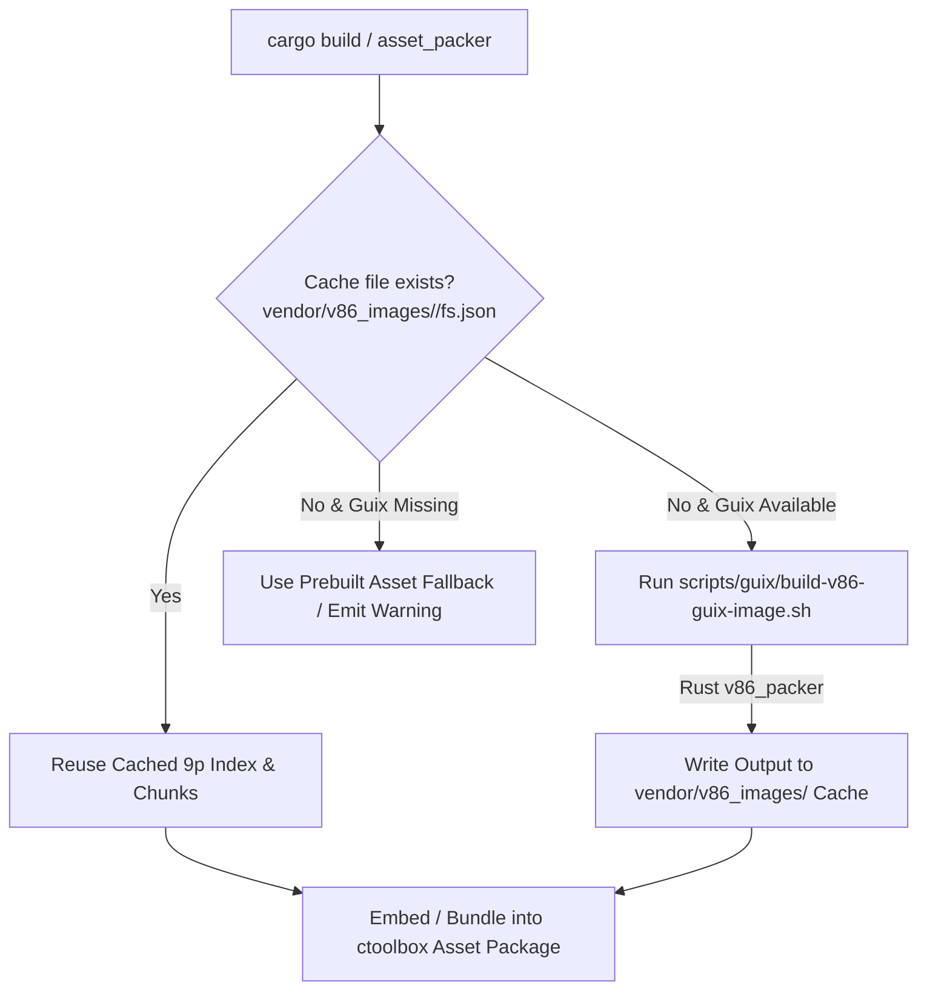

# Implementation Plan: Browser-based 32-bit x86 GUI via v86

This plan outlines the architecture, evaluation, OS image bootstrapping strategy, build caching design, native Rust 9pfs tooling, web routing, and integration workflow to run a 32-bit x86 operating system (Guix, for now, maybe Alpine or Arch later) with a working X server (GUI) in v86 inside the `ctoolbox` web UI.

---

## Response to User Feedback & Image Optimization

### 1. Guix Footprint Minimization Alternative
- **Guix System Footprint (`i686-linux`)**: Minimal `operating-system` definition for v86 includes *only* `glibc`, `busybox`/`coreutils`, `xorg-server`, `xf86-video-vesa`, `openbox`, `xterm`, and `virtio-9p` kernel drivers.
- **On-Demand 9p HTTP Range Loading**: Because v86 requests files dynamically over 9p via XMLHttpRequests, only the files accessed during boot and GUI startup are downloaded (~15 MB - 25 MB total network payload in the browser).
- **Multi-Profile Support**: The web UI will allow `Guix (Source Bootstrapped)` only for now in the OS selector.

### 2. UI Styling Guidelines
- **Project Design System**: Leverage pre-existing CSS design system and themeable widgets (e.g. `button`, `ctb-button`).
- **Clean HTML Layout**: Use plain HTML structural layout matching the upstream v86 page and controls within the application template. No custom CSS or non-layout EncreCSS/Tailwind utility classes are introduced.

### 3. Persistent Build Caching Location
- **Vendor Cache Directory**: Output artifacts (`fs.json` index and flat SHA256 file chunks) are cached in `vendor/v86_images/<profile>/`.
- **Gitignore Tracking**: `/vendor/v86_images/` is added to `.gitignore` so that wiping the `built/` directory during `cargo clean` or asset rebuilds does not destroy the slow-generated OS image assets.

### 4. Zero Host Python Dependency (Native Rust 9pFS Tooling)
- **Rust Implementation**: Replace upstream Python scripts (`fs2json.py` and `copy-to-sha256.py`) with native Rust helper functions inside `ctb_build_support::v86_packer`.
- **Attribution Notes**: Add clear docblock attribution referencing the original v86 python scripts (`assets/web/vendor/v86/tools/fs2json.py` and `copy-to-sha256.py`).
- **No Python Required**: The host build machine needs zero Python packages/dependencies to process rootfs tarballs into 9pfs JSON indices and content-addressed Zstd chunk stores.

---

## Build Caching Architecture

To prevent the slow image generation step from running during standard `cargo build` or `./run-quick` invocations:



1. **Cache Location**: Store built 9pfs output artifacts in `vendor/v86_images/<profile>/`. Add `/vendor/v86_images/` to `.gitignore`.
2. **Cache Check & Invalidation**:
   - The build script (`ctb_build_support::asset_packer`) checks if `vendor/v86_images/<profile>/fs.json` exists.
   - If the cached image is present, the build process reuses it immediately with zero compilation overhead.
   - Rebuilding is performed *only* when the image is missing or when explicitly requested via `REBUILD_V86_IMAGES=1` environment variable.
3. **Build Machine Requirement**: Requiring Guix on the build machine for the *initial* build is acceptable. Subsequent local builds rely on the cached output in `vendor/v86_images/`.

---

## Technical Architecture & v86 Integration

```mermaid
flowchart TD
    subgraph Host Build / Guix Sandbox
        A[Guix Scheme Def: v86-os.scm] -->|guix system image / pack| B[Rootfs Tarball]
        B -->|Rust v86_packer::pack_rootfs| C[fs.json 9p Index]
        B -->|Rust v86_packer::pack_rootfs| D[Flat SHA256 Chunk Files]
        C --> E[vendor/v86_images/ Cache]
        D --> E
    end

    subgraph ctoolbox Web UI Server (Axum)
        F[Axum Route /v86] --> G[v86 Controller]
        G --> H[v86.hbs View]
        I[Static Assets Engine] -->|Serves| J[libv86.js & v86.wasm]
        I -->|Serves| K[SeaBIOS & VGABIOS]
        I -->|Serves| L[Cached 9p FS Chunks & Index]
    end

    subgraph Browser Client
        H --> M[V86 Emulator Canvas]
        M -->|virtio-9p requests| L
    end
```

### 1. Native Rust 9pFS Packer (`ctb_build_support::v86_packer`)
- Converts a rootfs directory or `.tar` archive directly into v86's 9p filesystem format:
  - Generates `fs.json` v3 index (node arrays matching v86 `IDX_NAME`, `IDX_SIZE`, `IDX_MTIME`, `IDX_MODE`, `IDX_UID`, `IDX_GID`, `IDX_TARGET`).
  - Computes SHA256 file hashes and writes Zstandard-compressed chunk files (`<hash[0..8]>.bin.zst`) into `vendor/v86_images/<profile>/`.
- Contains attribution header referencing `assets/web/vendor/v86/tools/fs2json.py` and `copy-to-sha256.py`.

### 2. OS Bootstrapping Strategy (Guix System `i686-linux`)
- **Guix OS Definition (`scripts/guix/v86-os.scm`)**: Defines an `operating-system` record configured for `i686-linux` with:
  - Linux kernel configured with `virtio`, `virtio_pci`, `9p`, `9pnet`, `9pnet_virtio` drivers.
  - Minimal X11 display setup (`xorg-server`, `xf86-video-vesa`, `xf86-video-fbdev`, `openbox`, `xterm`).
  - Auto-login on `tty1` / `ttyS0` starting `xinit` or Openbox window manager.
  - Shepherd init service mounting 9p rootfs (`host9p`).
- **Build Pipeline (`scripts/guix/build-v86-guix-image.sh`)**:
  1. Runs `guix system image --system=i686-linux --image-type=tarball scripts/guix/v86-os.scm` inside a Guix sandbox.
  2. Calls Rust helper (`ctb_build_support::v86_packer`) to convert tarball directly to `fs.json` and chunk files in `vendor/v86_images/guix/`.

### 3. v86 Engine Integration
- **Source assets**: Use v86 files in `assets/web/vendor/v86`.
- **WASM & JS**: Deliver `libv86.js` and `v86.wasm` with BIOS binaries (`seabios.bin`, `vgabios.bin`).
- **9p Filesystem Driver**: Mount rootfs via 9p in v86:
  ```js
  const emulator = new V86({
      wasm_path: "/vendor/v86/build/v86.wasm",
      memory_size: 512 * 1024 * 1024,
      vga_memory_size: 8 * 1024 * 1024,
      screen_container: document.getElementById("screen_container"),
      bios: { url: "/vendor/v86/bios/seabios.bin" },
      vga_bios: { url: "/vendor/v86/bios/vgabios.bin" },
      filesystem: {
          baseurl: "/images/guix-rootfs-flat/",
          basefs: "/images/guix-fs.json"
      },
      autostart: true,
      bzimage_initrd_from_filesystem: true,
      cmdline: "rw root=host9p rootfstype=9p rootflags=trans=virtio,cache=loose modules=virtio_pci tsc=reliable vga=0x344",
  });
  ```

---

## Proposed Changes

### Build & OS Tools
#### [NEW] [v86_packer.rs](file:///workspaces/ctoolbox/src/build_support/v86_packer.rs)
- Native Rust 9pfs indexer and chunk compressor, replacing Python dependencies (`fs2json.py` and `copy-to-sha256.py`), with attribution documentation.

#### [NEW] [v86-os.scm](file:///workspaces/ctoolbox/scripts/guix/v86-os.scm)
- Minimal Guix package and `operating-system` definition for 32-bit `i686-linux` with Xorg, Openbox, and 9p virtio support.

#### [NEW] [build-v86-guix-image.sh](file:///workspaces/ctoolbox/scripts/guix/build-v86-guix-image.sh)
- Shell script to run Guix image build, export rootfs tarball, and convert via Rust `v86_packer` to 9pfs index (`fs.json`) and chunk files in `vendor/v86_images/guix/`.

#### [MODIFY] [.gitignore](file:///workspaces/ctoolbox/.gitignore)
- Add `/vendor/v86_images/` to `.gitignore`.

#### [MODIFY] [asset_packer.rs](file:///workspaces/ctoolbox/src/build_support/asset_packer.rs)
- Add build caching check for `vendor/v86_images/<profile>/fs.json`. Skip rebuilding image if cached artifact exists in `vendor/v86_images/`.

---

### Backend (Axum WebUI Server)

#### [NEW] [v86.rs](file:///workspaces/ctoolbox/src/io/webui/controllers/v86.rs)
- Axum controller handling `/v86` and `/v86/{profile}` routes (supporting profile selection: just `guix` for now).

#### [MODIFY] [routes.rs](file:///workspaces/ctoolbox/src/io/webui/routes.rs)
- Add route `/v86` and `/v86/{profile}` to `build_routes`.

#### [MODIFY] [controllers/mod.rs](file:///workspaces/ctoolbox/src/io/webui/controllers/mod.rs)
- Export `pub mod v86;`.

---

### Frontend & UI Design

#### [NEW] [v86.hbs](file:///workspaces/ctoolbox/assets/web/views/v86.hbs)
- Standard HTML layout template matching upstream v86 page within the app layout template.
- Uses existing design system buttons (`ctb-button` / `button`) for controls (OS Selector, Start/Pause, Reset, Fullscreen, Save/Restore state). No custom or non-layout CSS.
- Canvas screen container for graphical X11 desktop display.

---

## Verification Plan

### Automated Tests
- Run `./lint --quick` to verify JS/TS type safety.
- Run `cargo check -p ctb_webui` to verify Axum controller and route compilation.
- Add unit tests in `v86_packer.rs` to verify Rust implementation of `fs.json` schema and chunking matches v86 expectations.
- Run unit/integration tests (`cargo test -p ctb_webui`).

### Manual Verification
- Launch web server with `cargo run` / `./run-quick`.
- Navigate to `http://localhost:8080/v86` in browser.
- Verify BIOS initialization, 9p kernel loading, Xorg graphical server startup, mouse/keyboard input responsiveness, and window manager GUI display.
