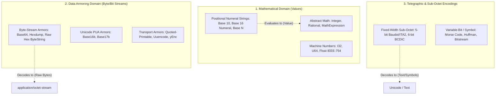

Could you help me think through the concept tree for mathematics, number representations, and 'armor' encodings of data in my utilities/formats/data format registry? It's currently feeling muddled. We've got: "MathExpression" in Semantic category - that's like, "1 + 2x". "BaseString" in Semantic category, which is kind of ambiguous. There are *byte-oriented* base strings like standard base64 or a hexdump (in Armor category), and there are *mathematical* base strings representing a number in a given base (mostly missing, but "Hexadecimal" in Armor category has a name that is ambiguous - I think I meant for it to mean basically a hexdump with no non-digit characters) - in some cases these may be more or less equivalent, but you can "round" a hexadecimal number, but you can't "round" a hexdump (even if it's "the same") because it would drop leading zero bytes. There are also bits and non-octet-oriented systems like Baudot code (mostly missing here). There's Base17b, which is a way of encoding binary data into Unicode text by using private use area characters (in Armor category). There are abstract numbers (like "Integers" or "Rational" numbers), and representations of those numbers like floating point or I32, which are in the Number category.

My feeling is that the formats I've defined don't currently form a coherent structure, and it's not clear to me how I should represent *mathematical* bases like hexadecimal numbers (presumably 'named' bases from base.rs such as hexadecimal should get format Dcs, and other bases should get represented... somehow? There are an infinite number of possible bases, so there should probably be a way to indicate that in the schema for these files, but I'm not sure what.

I can't change what already-assigned Dcs represent, but I can add clarification, change categories, adjust "Ident"s, and add new formats or categories.

This application has a wide range of base conversion and formatting tools, which currently muddle up mathematical and byte-oriented concepts quite a bit, since I didn't really understand or think about that distinction and added tools as I needed them.

Could you suggest steps I can take to clean up the formats database to be more conceptually precise, logical, comprehensive, and flexible?


Searched for "MathExpression"
Listed directory formats
Viewed armor.csv:1-63
Viewed number.csv:1-34
Viewed semantic.csv:1-25
Viewed base.rs:1-120
Searched for "enum"
Viewed base.rs:120-250
Viewed base.rs:250-360
Viewed base.rs:360-450
Searched for "FormatId"
Viewed format_id.rs:200-320
Viewed format_id.rs:320-389
Viewed format_id.rs:1-100
Searched for "formats.generated.csv"
Searched for "FormatCategory"
Viewed detection.rs:25-60
Viewed format_info.rs:1-100
Searched for "Base16b"

To untangle the concepts across mathematics, numeral representations, and data armoring in your format registry, the most important step is to separate **value-centric semantics** (numbers & algebra) from **data-stream serialization** (bytes & bits).

Currently, terms like *“hexadecimal”* or *“base64”* are overloaded to mean both **positional radix notation for numbers** and **textual armoring of raw byte sequences**.

---

### 1. The Core Ontological Triad

Here is the clean mental model to separate these domains:



#### Key Differences Between the Domains:

| Property | Positional Numeral (Math) | Data Armor (Serialization) | Sub-Octet / Telegraphic |
| :--- | :--- | :--- | :--- |
| **Domain Input** | Mathematical number ($\mathbb{Z}, \mathbb{Q}, \mathbb{R}$) | Arbitrary `&[u8]` sequence | Stream of symbols or $k$-bit tokens |
| **Leading Zeros** | Semantically insignificant (`0042 == 42`) | **Critical** (`0042` is 2 bytes; `42` is 1 byte) | Dictated by framing/character bounds |
| **Mathematical Operations** | Rounding, negation, addition, fractions (`.`) | Meaningless / Prohibited | Meaningless (only shift states / FIGS / LTRS) |
| **Padding / Block framing** | Not applicable | Block padding (`=`, remainder markers) | Word shifts, start/stop pulses, sync marks |
| **Alphabet / Case** | Usually case-insensitive ($0\text{xa} = 0\text{xA}$) | Often case-sensitive (Base64 `a` $\neq$ `A`) | Shift-state dependent (Letters vs Figures) |

---

### 2. Untangling Existing Dcs in the Database

Because existing [Dc](file:///workspaces/ctoolbox/src/formats/utilities/data/formats/armor.csv) numbers cannot change their core meaning, you can clean them up via **`Ident` renaming/clarification**, **re-categorization**, and **setting proper `BaseFormat` chains**:

1. **`Hexadecimal` (Dc 2228277) in [armor.csv](file:///workspaces/ctoolbox/src/formats/utilities/data/formats/armor.csv)**:
   - **Current issue:** Label is ambiguous between a continuous hex byte string (raw byte armor) and a hex integer string.
   - **Fix:** Clarify `Ident` or `Label` to `HexByteString` or `HexStream` with comment: *"Continuous hex-encoded byte stream without separators (e.g. deadbeef for 4 bytes)"*.
   - Keep `HexdumpPlain`, `HexdumpFancy437`, and `HexdumpXxd` deriving from `Hexdump` / `HexByteString`.

2. **`BaseString` (Dc 2228275) in [semantic.csv](file:///workspaces/ctoolbox/src/formats/utilities/data/formats/semantic.csv)**:
   - **Current issue:** Overloaded comment *"Numbers/data encoded using an alphabet"*.
   - **Fix:** Keep as the abstract parent format for string-encoded positional numerals (or rename Label to *“Positional Numeral String”*), distinct from `armor` formats.

3. **`Base16b` & `BaseNb` (Dc 2228281, 2228236) in [armor.csv](file:///workspaces/ctoolbox/src/formats/utilities/data/formats/armor.csv)**:
   - These are binary-to-text/PUA armoring formats and correctly belong in `armor`. Add explicit notes that they preserve exact byte counts via remainder encoding.

4. **`MathExpression` (Dc 2228448)**:
   - Retain in `semantic` (or a dedicated `math` category if added), representing symbolic algebraic expressions (`1 + 2x`, ASTs, MathML text) rather than scalar numbers.

5. **`Integer`, `Natural`, `Float` vs `U32`, `I32` in [number.csv](file:///workspaces/ctoolbox/src/formats/utilities/data/formats/number.csv)**:
   - Create a subcategory or base-format distinction:
     - *Abstract Numbers* (`Natural`, `Integer`, `Rational`, `Real`, `Complex`)
     - *Machine Binary Representations* (`U8`, `I32`, `U64`, `Float` [IEEE-754], `Fixed`, `Pack32`)

---

### 3. Representing Mathematical Bases (Infinite / Parametric Radices)

Since radices are infinite ($2 \le N \le \infty$), you cannot assign a static `Dc` to every base. Here is the recommended schema strategy:

#### A. The Canonical Named Bases (Assigned Dcs)
Assign explicit Dcs in a `number` or `math` category for standard conventional positional systems:
- `BinaryNumeral` (Base 2: `0b...` or binary digits)
- `OctalNumeral` (Base 8: `0o...` or octal digits)
- `DecimalNumeral` (Base 10: standard decimal numbers, signs, fractional points)
- `DuodecimalNumeral` (Base 12: dozenal)
- `HexadecimalNumeral` (Base 16: mathematical hex scalar, distinct from byte armor)
- `Base36Numeral` (Alphanumeric 0-9, A-Z)
- `Base62Numeral` / `Base64Numeral` (when evaluating as big positional integers)

#### B. The Generic Family Format (Parametric Base)
Introduce a family format:
- **`BaseNNumeral`** (BaseFormat: `BaseString` or `Number`):
  - In StageL/Format specs, parameterized as: `BaseNNumeral(radix: 17, alphabet: Standard, case_sensitive: false)`
- **`BaseNArmor`** (in `armor.csv`):
  - Parameterized as: `BaseNArmor(radix: 85, alphabet: Ascii85, padding: true)`

---

### 4. Proposed Cleaned Category Tree

```text
├── math / semantic
│   ├── MathExpression          (Symbolic expressions, ASTs, formulas)
│   ├── PositionalNumeralString (Base parent for numeral strings)
│   │   ├── BinaryNumeral       (Base 2 scalar)
│   │   ├── OctalNumeral        (Base 8 scalar)
│   │   ├── DecimalNumeral      (Base 10 scalar, floats, scientific notation)
│   │   ├── HexadecimalNumeral  (Base 16 scalar, e.g. 0xFF or math int)
│   │   └── BaseNNumeral        (Parameterized: radix N + custom alphabet)
│
├── number
│   ├── Abstract
│   │   ├── Natural             (N >= 0)
│   │   ├── Integer             (Z)
│   │   ├── Rational            (p/q)
│   │   └── Real / FloatScalar
│   └── MachineBinary
│       ├── U8, I8, U16, I16, U32, I32, U64, I64, U128, I128
│       ├── Float32, Float64    (IEEE 754)
│       ├── FixedPoint          (Q-format, scaled int)
│       └── Pack32
│
├── armor (Byte/Bit Stream to Text Encodings)
│   ├── HexByteStream           (Raw hex representation of bytes, e.g. "48656c6c6f")
│   │   ├── HexdumpPlain
│   │   ├── HexdumpFancy437
│   │   └── HexdumpXxd
│   ├── Base64Family
│   │   ├── Base64Standard      (RFC 4648)
│   │   ├── Base64Url
│   │   └── MimeBase64
│   ├── Base32 / Base58 / Base85 (Ascii85, Z85)
│   ├── PuaArmor
│   │   ├── Base16b
│   │   └── Base17b
│   └── TransportArmor          (QuotedPrintable, Uuencode, yEnc, BinHex)
│
└── encoding (Character & Sub-Octet Encodings)
    ├── SubOctet
    │   ├── Baudot_ITA2         (5-bit teletype code with FIGS/LTRS shift)
    │   ├── BCDIC_SixBit        (6-bit telegraphic/mainframe code)
    │   └── MorseCode           (Variable timing symbols)
    └── OctetText
        ├── Utf8, Utf16, Utf32
        └── LegacyCodePages     (Cp437, MacRoman, ISO-8859-*)
```

---

### 5. Recommended Concrete Next Steps

1. **Clarify Existing Labels & Comments in [armor.csv](file:///workspaces/ctoolbox/src/formats/utilities/data/formats/armor.csv)**:
   - Update `Hexadecimal` (Dc 2228277) label/comments to explicitly state it is a byte-stream hex encoding.
2. **Add Canonical Numeral Dcs in [number.csv](file:///workspaces/ctoolbox/src/formats/utilities/data/formats/number.csv) or `math.csv`**:
   - Register distinct Dcs for `BinaryNumeral`, `OctalNumeral`, `DecimalNumeral`, `HexadecimalNumeral`, `Base36Numeral`, and generic `BaseNNumeral`.
3. **Register Non-Octet / Telegraphic Dcs in [encoding.csv](file:///workspaces/ctoolbox/src/formats/utilities/data/formats/encoding.csv)**:
   - Add `Baudot_ITA2`, `SixBitBCD`, and `MorseCode`.
4. **Align Rust Types in [base.rs](file:///workspaces/ctoolbox/src/formats/math/base.rs)**:
   - Keep [Base](file:///workspaces/ctoolbox/src/formats/math/base.rs#L35) and [NumeralSystem](file:///workspaces/ctoolbox/src/formats/math/base.rs#L191) strictly for the mathematical domain (`Natural` / `Integer` $\leftrightarrow$ string representation).
   - Ensure byte armoring (like hex dumpers and base64) uses byte-slice functions (`&[u8] -> String`), while numeral conversions use [parse_natural_system](file:///workspaces/ctoolbox/src/formats/math/base.rs#L399) / [Natural](file:///workspaces/ctoolbox/src/formats/math/base.rs#L31).