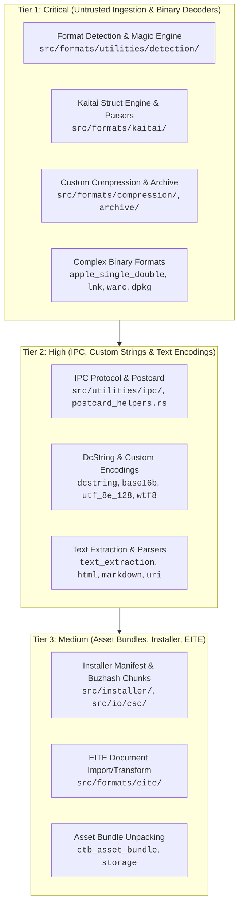
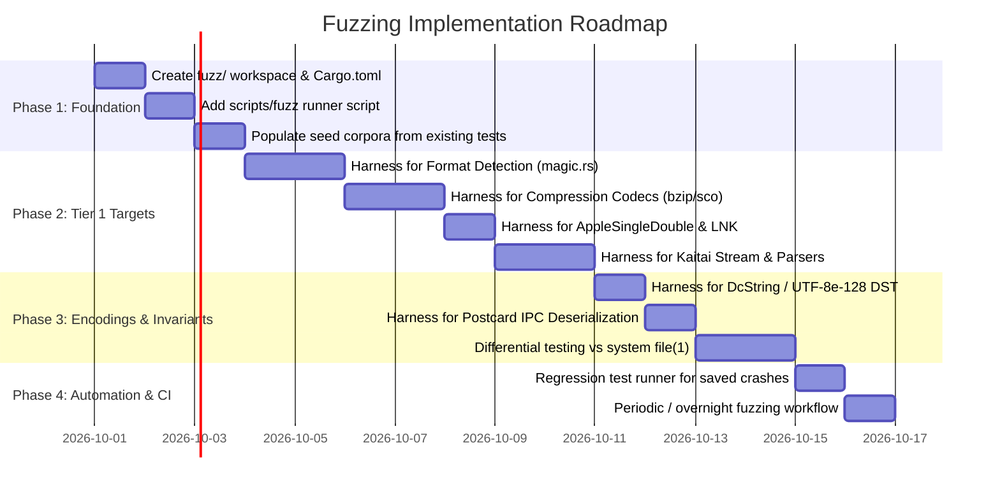

# Fuzzing Assessment and Implementation Plan for Collective Toolbox

## Executive Summary

Collective Toolbox (`ctoolbox`) is a multi-process document workspace, database, and utility ecosystem featuring over 50 format-handling sub-crates (`src/formats/*`), a multi-process IPC bus (`src/utilities/ipc`), compression/archive engines, and file format detection infrastructure.

Because `ctoolbox` is designed to ingest, identify, unpack, extract, and convert arbitrary untrusted files and byte streams, **fuzzing offers exceptionally high value for this project**.

While Rust's type system and memory-safety guarantees prevent classic memory corruption (buffer overflows, use-after-free) in safe code, parsers are inherently vulnerable to:
1. **Panics & Invariant Violations:** Unhandled slice out-of-bounds indexing (`&buf[offset..end]`), integer arithmetic overflow/underflow, unwrap/expect on unexpected inputs, and regex parse failures.
2. **Denial-of-Service (DoS) & Resource Exhaustion:** Infinite loops in stream decoders, recursion stack overflows (such as indirect offset resolution in `file(1)` magic rules), and decompression/allocation bombs.
3. **Roundtrip Inconsistencies:** Silent data loss or mutation during encoding/decoding (`decode(encode(x)) != x`).

This write-up analyzes the value proposition, maps out priority fuzzing surfaces across the codebase, evaluates implementation difficulty, and provides a turnkey implementation plan with concrete harness examples.

---

## 1. Value Proposition: What Fuzzing Brings to `ctoolbox`

### 1.1 Alignment with Project Invariants & Style Guide
The repository style guide ([`AGENTS.md`](file:///workspaces/ctoolbox/AGENTS.md)) establishes strict requirements:
- *"Avoid panics, but do not fail silently - fail early and loudly: For any fallible operation or suppressed error condition, the function signature will be refactored to return anyhow::Result<T> and propagate errors using ?."*
- *"Explicitly use checked or saturating arithmetic as appropriate; Clippy will deny the infix math operators."*
- *"Never use as for type conversions. Use try_from or similar instead."*

Fuzzing is the most efficient automated technique to verify these invariants under adversarial and malformed inputs. It systematically stresses slice slicing bounds, numeric casts, and fallback logic, converting latent panics into proper `Result::Err` returns.

### 1.2 Specific Vulnerability Classes Addressed

| Vulnerability Class | Risk in `ctoolbox` | Target Subsystems | Value of Fuzzing |
| :--- | :--- | :--- | :--- |
| **Slice Indexing Panics** | High | `detection/magic.rs`, `apple_single_double`, `lnk`, `bzip`, `sco_compress` | Direct identification of unverified offsets and lengths in byte slices before production deployment. |
| **Arithmetic Overflow / Underflow** | Medium–High | Offset calculators, bitstream readers (`bzip`, `kaitai`), BaseN numeral parsers | Validates that all index arithmetic uses saturating/checked operations as mandated by project Clippy lints. |
| **Recursion Stack Exhaustion** | High | `detection/magic.rs` (indirect offsets), Kaitai recursive types, container parsing | Verifies recursion depth limits (e.g. reproducing/preventing issues like `CVE-2014-1943` in Apple driver maps). |
| **Decompression / Memory Bombs** | High | `ctb-formats-compression`, `ctb-formats-archive`, `kaitai` repeat-until loops | Detects unbounded memory allocations (`Vec::with_capacity` driven by untrusted headers) and CPU-bound infinite loops. |
| **IPC Deserialization Failures** | Medium | `ctb-utilities/ipc`, `postcard_helpers.rs` | Ensures IPC endpoints in the main workspace process never panic or crash when handling malformed payloads from sandboxed subprocesses. |
| **Roundtrip & Lossless Invariants** | High | `base16b`, `utf_8e_128`, `dcstring`, `dcdata`, `apple_single_double` | Proves mathematical correctness: `decode(encode(v)) == v` across arbitrary valid values. |
| **Unsafe DST Invariant Soundness** | High | `dcstring` ([`unsafe.md`](file:///workspaces/ctoolbox/src/formats/dcstring/unsafe.md)) | Running fuzz targets under AddressSanitizer (ASan) and UndefinedBehaviorSanitizer (UBSan) guarantees pointer casts for `DcStr` DST slices never violate memory bounds. |

### 1.3 Differential Fuzzing Opportunities
- **Detection Parity:** In [`docs/file-info.md`](file:///workspaces/ctoolbox/docs/file-info.md#L137) (Sub-Phase 5G), the project already has an upstream test harness comparing against host `file(1)`. Differential fuzzing can feed identical random or mutated byte streams to both `ctb_formats_utilities::detection::guess_format_report` and system `file(1)` to discover discrepancies and unhandled MIME mappings automatically.
- **Kaitai Reference Parity:** Cross-checking `ctb-formats-kaitai` parsers against canonical Kaitai Struct outputs.

---

## 2. Target Mapping & Prioritization Matrix

The repository contains distinct tiers of fuzzing value based on exposure to untrusted inputs, algorithmic complexity, and blast radius:



### Detailed Target Breakdown

#### Tier 1: Critical — Untrusted Input Parsers (Highest ROI)
1. **File Format Detection & Magic Matching**
   - **Location:** [`src/formats/utilities/detection/`](file:///workspaces/ctoolbox/src/formats/utilities/detection/)
   - **Key Files:** [`magic.rs`](file:///workspaces/ctoolbox/src/formats/utilities/detection/magic.rs), [`magic_parser.rs`](file:///workspaces/ctoolbox/src/formats/utilities/detection/magic_parser.rs), [`container.rs`](file:///workspaces/ctoolbox/src/formats/utilities/detection/container.rs), [`detection.rs`](file:///workspaces/ctoolbox/src/formats/utilities/detection.rs)
   - **Functions to Fuzz:** `guess_format_report(&[u8])`, `evaluate_rule()`, `parse_magic_line()`, `sniff_container()`.
   - **Why:** Ingests completely arbitrary, hostile byte sequences. Uses recursive indirect offset evaluations (`>...`), variable search limits, and complex string/regex extractors. Prior vulnerability history in upstream `file(1)` (e.g. `CVE-2014-1943`) illustrates the need for exhaustive fuzzing against deep recursion and cyclic references.

2. **Kaitai Struct Engine & Runtime**
   - **Location:** [`src/formats/kaitai/`](file:///workspaces/ctoolbox/src/formats/kaitai/)
   - **Key Files:** [`runtime/runtime.rs`](file:///workspaces/ctoolbox/src/formats/kaitai/runtime/runtime.rs), generated parsers in `generated/` (300+ format test cases).
   - **Why:** Explicitly flagged in [`issues/issues.md`](file:///workspaces/ctoolbox/issues/issues.md#L59): *"Kaitai should use Result (bail on violated invariants) and remove all panicking code"*. Binary structures with user-specified lengths, repeat counts, bit streams, and switch expressions are prone to integer overflows, panicking slice slices, and OOM.

3. **Compression & Decompression Codecs**
   - **Location:** [`src/formats/compression/`](file:///workspaces/ctoolbox/src/formats/compression/)
   - **Key Files:** [`sco_compress.rs`](file:///workspaces/ctoolbox/src/formats/compression/sco_compress.rs), [`bzip.rs`](file:///workspaces/ctoolbox/src/formats/compression/bzip.rs), [`pack.rs`](file:///workspaces/ctoolbox/src/formats/compression/pack.rs), [`compact.rs`](file:///workspaces/ctoolbox/src/formats/compression/compact.rs).
   - **Functions to Fuzz:** `bzip::decompress(&[u8])`, `sco_compress::decompress_stream()`, `inverse_bwt()`, `decode_mtf_block()`, `rle1_decode()`.
   - **Why:** Custom/ported implementations of complex bit-level decompression algorithms. Corrupt tables, invalid Huffman trees, and cyclic run-length encoding can easily induce infinite loops or out-of-bound array indexing.

4. **Complex Binary Envelopes & Containers**
   - **Location:** [`src/formats/apple_single_double/`](file:///workspaces/ctoolbox/src/formats/apple_single_double/), [`src/formats/lnk/`](file:///workspaces/ctoolbox/src/formats/lnk/), [`src/formats/archive/`](file:///workspaces/ctoolbox/src/formats/archive/)
   - **Functions to Fuzz:** `read_apple_single_double(&[u8])`, `binrw::BinReaderExt::read_le::<ShellLink>(&mut cursor)`, archive unpackers.
   - **Why:** Involves complex offset tables, entry descriptors, and resource fork trees.

#### Tier 2: High Value — Encodings, IPC, and String DSTs
1. **Custom String Types and DST Unsafe Code**
   - **Location:** [`src/formats/dcstring/`](file:///workspaces/ctoolbox/src/formats/dcstring/)
   - **Key Files:** [`dc_str.rs`](file:///workspaces/ctoolbox/src/formats/dcstring/dc_str.rs), [`dc_char.rs`](file:///workspaces/ctoolbox/src/formats/dcstring/dc_char.rs), [`dcstring_impl.rs`](file:///workspaces/ctoolbox/src/formats/dcstring/dcstring_impl.rs).
   - **Why:** Contains raw pointer conversions for Dynamically Sized Types (`&[u8]` as `*const DcStr`). Must be verified with ASan that malformed UTF-8e-128 sequences never cause invalid memory reads.
2. **Postcard IPC Deserialization**
   - **Location:** [`src/utilities/postcard_helpers.rs`](file:///workspaces/ctoolbox/src/utilities/postcard_helpers.rs), [`src/utilities/ipc/`](file:///workspaces/ctoolbox/src/utilities/ipc/)
   - **Functions to Fuzz:** `postcard_helpers::decode::<T>(&[u8], context)` for all IPC DTO types.
   - **Why:** Protects process boundaries between renderer, webui, and main workspace.

---

## 3. Implementation Feasibility & Tooling Evaluation

### 3.1 Tool Selection: Why `cargo-fuzz` (libFuzzer) is the Best Fit

| Fuzzing Tool | Pros | Cons | Recommendation |
| :--- | :--- | :--- | :--- |
| **`cargo-fuzz`** *(libFuzzer)* | • In-process execution (10,000–50,000 exec/s)<br>• Native LLVM coverage guidance<br>• First-class ASan, UBSan, MSan integration<br>• Standard in the Rust ecosystem | • Requires nightly compiler for instrumentation | **Primary Recommendation** |
| **`bolero`** | • Single harness compiles to `cargo test` (property testing) or `libfuzzer`/`afl`<br>• Works on stable compiler for proptest mode | • Slightly more abstraction layers | **Excellent Secondary Option** |
| **`cargo-afl`** | • Excellent mutation heuristics for complex file formats | • Out-of-process forks are slower<br>• More complex build setup | Optional for deep long-running runs |
| **`proptest`** / `quickcheck` | • Runs in standard `cargo test`<br>• Great for basic roundtrip invariants | • Not coverage-guided; won't find deep parser edge cases | Use for unit tests, not fuzzing |

### 3.2 Ease of Implementation in `ctoolbox`

Implementing `cargo-fuzz` in this codebase is **straightforward (estimated initial setup: 2 to 4 hours)** for several reasons:

1. **Modular Sub-Crate Architecture:**
   As noted in [`AGENTS.md`](file:///workspaces/ctoolbox/AGENTS.md): *"Prefer building or testing individual workspace crates. A full build takes 5 to 10 minutes."*
   Fuzz targets depend directly on isolated sub-crates (e.g. `ctb-formats-utilities`, `ctb-formats-compression`, `ctb-formats-apple-single-double`). Compiling a fuzz harness only builds the target sub-crate and its direct dependencies, taking **under 30 seconds** rather than rebuilding the full workspace.
2. **Ready-Made Seed Corpora Already in Repository:**
   Effective fuzzers need high-quality seeds. The repository already includes rich test datasets:
   - Upstream `file(1)` test cases: `src/formats/dcdata/data/magic/upstream/magic/tests/` (88 canonical test files).
   - Kaitai fixture datasets: `src/formats/kaitai/tests/` and `kaitai_struct_tests/`.
   - AppleSingle/Double sample assets: `src/formats/apple_single_double/data/`.
   - LNK fixtures: `src/formats/lnk/data/`.
   These can be directly linked or copied into the fuzzer's corpus directories to seed mutation engines instantly.
3. **No Conflict with `ctb_test` Macros:**
   `cargo-fuzz` targets use the `fuzz_target!(|data: &[u8]| { ... });` macro and execute as dedicated standalone binary targets, completely bypassing standard test macros and avoiding any conflict with repository test rules.

---

## 4. Implementation Blueprint & Architecture

### 4.1 Recommended Workspace Structure

A standalone `fuzz/` folder at the repository root isolates fuzz dependencies, build scripts, and corpora without modifying production crates:

```
ctoolbox/
├── fuzz/
│   ├── Cargo.toml                  # Dedicated fuzz package (excluded from root workspace)
│   ├── corpus/                     # Seed corpora for each target
│   │   ├── fuzz_magic/             # Symlinks/copies from dcdata/data/magic/...
│   │   ├── fuzz_apple_single_double/
│   │   ├── fuzz_bzip/
│   │   └── fuzz_kaitai/
│   ├── artifacts/                  # Auto-generated crash reports (gitignored)
│   └── fuzz_targets/
│       ├── fuzz_magic.rs
│       ├── fuzz_magic_parser.rs
│       ├── fuzz_apple_single_double.rs
│       ├── fuzz_bzip.rs
│       ├── fuzz_sco_compress.rs
│       ├── fuzz_lnk.rs
│       ├── fuzz_dcstring.rs
│       └── fuzz_ipc_postcard.rs
├── scripts/
│   └── fuzz                        # Helper script matching ./build and ./test-quick
└── Cargo.toml                      # Add "fuzz" to [workspace] exclude list
```

### 4.2 Sample Fuzz Targets Tailored to `ctoolbox`

#### Target 1: Format Detection & Magic Evaluation ([`fuzz_magic.rs`](file:///workspaces/ctoolbox/src/formats/utilities/detection/detection.rs))
```rust
#![no_main]

use libfuzzer_sys::fuzz_target;
use ctb_formats_utilities::detection::guess_format_report;

fuzz_target!(|data: &[u8]| {
    // Fuzzes the entire detection pipeline: container sniffing,
    // magic rule evaluation, indirect offsets, and mime derivation.
    // The invariant: this must NEVER panic, crash, or enter an infinite loop.
    let _ = guess_format_report(data);
});
```

#### Target 2: Decompression Invariants & DoS Protection ([`fuzz_bzip.rs`](file:///workspaces/ctoolbox/src/formats/compression/bzip.rs))
```rust
#![no_main]

use libfuzzer_sys::fuzz_target;
use ctb_formats_compression::bzip::{compress, decompress};

fuzz_target!(|data: &[u8]| {
    // 1. Robustness: decompress arbitrary bytes must return Ok/Err, never panic
    if let Ok(decompressed) = decompress(data) {
        // 2. Roundtrip property: if decompression succeeds and size is reasonable,
        // recompressing and decompressing must yield the exact same bytes.
        if decompressed.len() <= 1024 * 1024 {
            if let Ok(recompressed) = compress(&decompressed) {
                let roundtripped = decompress(&recompressed).expect("decompression of valid stream failed");
                assert_eq!(decompressed, roundtripped, "bzip roundtrip mismatch");
            }
        }
    }
});
```

#### Target 3: AppleSingle / AppleDouble Parsing & Roundtrip ([`fuzz_apple_single_double.rs`](file:///workspaces/ctoolbox/src/formats/apple_single_double/apple_single_double.rs))
```rust
#![no_main]

use libfuzzer_sys::fuzz_target;
use ctb_formats_apple_single_double::{read_apple_single_double, write_apple_single_double};

fuzz_target!(|data: &[u8]| {
    if let Ok(archive) = read_apple_single_double(data) {
        // Test serializer robustness and roundtrip property
        if let Ok(serialized) = write_apple_single_double(&archive) {
            let re_parsed = read_apple_single_double(&serialized);
            assert!(re_parsed.is_ok(), "Failed to re-parse successfully serialized AppleArchive");
        }
    }
});
```

#### Target 4: Custom DcString DST & UTF-8e-128 Decoding ([`fuzz_dcstring.rs`](file:///workspaces/ctoolbox/src/formats/dcstring/dc_str.rs))
```rust
#![no_main]

use libfuzzer_sys::fuzz_target;
use ctb_formats_dcstring::{DcStr, DcString};

fuzz_target!(|data: &[u8]| {
    // Test safe constructor
    if let Ok(dc_str) = DcStr::from_bytes(data) {
        // Invariant checks on validated DcStr
        let len_chars = dc_str.chars().count();
        let _ = dc_str.as_bytes();
        let owned = dc_str.to_dc_string();
        assert_eq!(owned.as_bytes(), data);
    }
});
```

#### Target 5: Postcard IPC Deserialization ([`fuzz_ipc_postcard.rs`](file:///workspaces/ctoolbox/src/utilities/postcard_helpers.rs))
```rust
#![no_main]

use libfuzzer_sys::fuzz_target;
use ctb_utilities::postcard_helpers::decode;
use serde::{Deserialize, Serialize};

#[derive(Serialize, Deserialize, Debug, PartialEq)]
enum SampleIpcMessage {
    Ping(u64),
    Request { id: u32, path: String, payload: Vec<u8> },
    Response { code: i32, data: Option<Vec<u8>> },
}

fuzz_target!(|data: &[u8]| {
    // Invariant: Malformed bytes from IPC socket must fail gracefully with Err
    let _: anyhow::Result<SampleIpcMessage> = decode(data, "fuzz_ipc_message");
});
```

---

## 5. Phased Implementation Roadmap



### Actionable Task Checklist

- [ ] **Phase 1: Foundation Setup**
  - [ ] Add `fuzz` to the `exclude` list in root [`Cargo.toml`](file:///workspaces/ctoolbox/Cargo.toml#L8).
  - [ ] Initialize `fuzz/Cargo.toml` with `libfuzzer-sys = "0.4"`.
  - [ ] Create `scripts/fuzz` wrapper script for intuitive usage (e.g. `./scripts/fuzz run fuzz_magic -- -max_total_time=60`).
  - [ ] Ingest seeds from `src/formats/dcdata/data/magic/upstream/magic/tests/` into `fuzz/corpus/fuzz_magic/`.

- [ ] **Phase 2: High-Value Target Implementation (Tier 1)**
  - [ ] Implement `fuzz_magic` for `guess_format_report`.
  - [ ] Implement `fuzz_magic_parser` for `/etc/magic` rule line parsing.
  - [ ] Implement `fuzz_bzip` and `fuzz_sco_compress` decompressors.
  - [ ] Implement `fuzz_apple_single_double` read/write roundtrip.
  - [ ] Implement `fuzz_kaitai_stream` runtime bit/integer parser.

- [ ] **Phase 3: Integrity & String Invariants (Tier 2)**
  - [ ] Implement `fuzz_dcstring` (verifying DST casts under ASan).
  - [ ] Implement `fuzz_base16b` and `fuzz_utf_8e_128` roundtrip invariants.
  - [ ] Implement `fuzz_ipc_postcard` message deserializers.

- [ ] **Phase 4: CI & Continuous Regression Testing**
  - [ ] Add a regression check in `./test-quick` or CI that executes all discovered crash artifacts against target harnesses (takes < 2 seconds, ensures fixed bugs never regress).
  - [ ] Set up optional continuous overnight fuzzing (via GitHub Actions `schedule` or a dedicated background process).

---

## Conclusion & Recommendation

Fuzzing is ideally matched to `ctoolbox`. The combination of:
1. Parsing untrusted, highly variable binary and text formats,
2. Strict architectural zero-panic requirements,
3. A modular workspace design allowing sub-30-second target compilation, and
4. Existing rich test corpora in `src/formats/`

makes fuzzing one of the highest-leverage quality assurance investments available for this codebase. Starting with Phase 1 and the Tier 1 targets (`fuzz_magic` and `fuzz_bzip`) will yield immediate reliability returns with minimal overhead.
