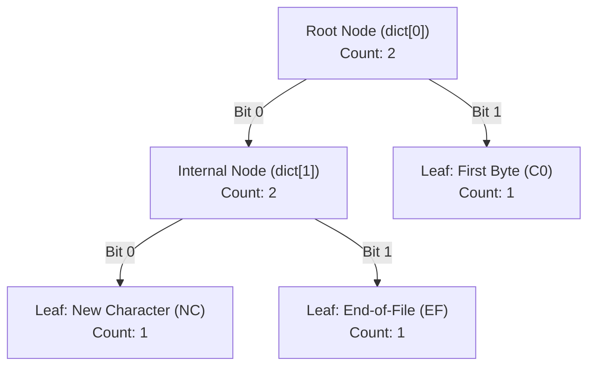

# Specification of `compact` and `uncompact`

This document details the command-line interface (CLI) and binary file format for the Unix `compact` and `uncompact` utilities (written by Colin L. McMaster, UCB, 1979).

---

## 1. Command-Line Interface (CLI) Specification

Both `compact` and `uncompact` can operate in two distinct modes:
1. **Filter Mode**: Standard input to standard output processing (when invoked with **no file arguments**).
2. **In-Place File Mode**: Argument-driven file transformation with automatic naming, permission preservation, and source removal (when invoked with **one or more file arguments**).

---

### 1.1 `compact` Utility

#### Synopsis
```sh
compact [file ...]
```

#### Behavior & Operations

* **Filter Mode (0 Arguments)**:
  * Reads uncompressed binary data from `stdin`.
  * Writes the compressed bitstream to `stdout`.
  * If compression does not reduce file size (compressed bytes $\ge$ uncompressed bytes), prints an error message to `stderr`:
    ```text
    Does not save bytes.
    Unsuccessful compact of standard input to standard output.
    ```

* **In-Place File Mode (1 or More File Arguments)**:
  * Processes each argument in the exact order specified on the command line.
  * **Filename Constraints**:
    * Total input filename length must be $< 77$ characters (`LNAME - 3`).
    * The basename component (filename without directory path) must not exceed $13$ characters.
    * Violation output (`stderr`): `<filename>: File name too long`
  * **Directory Check**:
    * Directories are rejected.
    * Output (`stderr`): `<filename>: Can't compact a directory`
  * **Magic Header Pre-Validation**:
    * If the input file is already compressed via `compact` (magic `017777`):
      Output (`stderr`): `<filename>: Already compacted.`
    * If the input file is packed via `pack` (magic `017437`):
      Output (`stderr`): `<filename>: Already packed using program pack. Use unpack.`
  * **Target File Creation**:
    * Output filename is generated by appending `.C` to the input file path (e.g., `data.txt` $\to$ `data.txt.C`).
    * The destination file is created with permissions (`st_mode`) copied directly from the source file.
  * **Compression Threshold & In-Place Replacement**:
    * If compressed size is **less than** original size:
      * Calculates savings percentage: $\text{Savings} = \left\lfloor \frac{100000 \times (\text{input\_bytes} - \text{output\_bytes})}{\text{input\_bytes}} + 5 \right\rfloor / 1000$
      * Prints report to `stderr`: `<filename>:  Compression : XX.XX%`
      * Deletes (`unlink`) the original uncompressed source file.
    * If compressed size is **greater than or equal to** original size:
      * Prints warning to `stderr`: `<filename>: Not compacted. Does not save bytes.`
      * Deletes (`unlink`) the partial `.C` output file.
      * Retains the original uncompressed source file untouched.
  * **Files Under 2 Bytes**:
    * Files of 0 or 1 byte cannot be compressed below their original size, so `compact` treats them as non-saving and retains the original file.

---

### 1.2 `uncompact` Utility

#### Synopsis
```sh
uncompact [file ...]
```

#### Behavior & Operations

* **Filter Mode (0 Arguments)**:
  * Reads compressed data from `stdin`.
  * Writes decompressed data to `stdout`.
  * If the input stream does not start with the valid `COMPACTED` magic header, outputs an error message to `stderr`:
    ```text
    Not a compacted file.
    Unsuccessful uncompact of standard input to standard output.
    ```

* **In-Place File Mode (1 or More File Arguments)**:
  * Processes each file argument sequentially in command-line order.
  * **Filename Constraints**:
    * Input file argument **must** end with the `.C` extension.
    * Output (`stderr`): `<filename>: File name must end with ".C"`
    * Total filename length must be $< 77$ characters, with basename length $\le 15$ characters.
    * Output (`stderr`): `File name too long -- <filename>`
  * **Target File Creation**:
    * Output filename is formed by stripping the trailing `.C` extension (e.g., `archive.tar.C` $\to$ `archive.tar`).
    * Destination file permissions are inherited from the `.C` file (`st_mode & 07777`).
  * **Format Verification**:
    * Verifies the 2-byte magic header.
    * If magic matches `PACKED` (`017437`): `<filename>: File is packed. Use unpack.`
    * If magic is unrecognised: `<filename>: Not a compacted file.`
    * On failure, deletes the partially written destination file.
  * **Decompression & Replacement**:
    * On successful extraction, prints status to `stderr`: `<filename> uncompacted to <output_filename>`
    * Deletes (`unlink`) the compressed `.C` source file upon completion.

---

## 2. Compact File Format Specification (`.C` Format)

Files generated by `compact` represent streams compressed with **Online Adaptive Huffman Coding (McMaster's Algorithm)**. Unlike static Huffman coders, `.C` files **do not** include a stored frequency table or tree header; both encoder and decoder start with identical baseline trees and dynamically adapt the Huffman tree state in lockstep as symbols are processed.

### 2.1 Binary Layout Overview

```text
+-----------------------+-----------------------+-----------------------+
|  Magic Header Byte 0  |  Magic Header Byte 1  | 1st Raw Data Byte C0  |
|         0xFF          |         0x1F          |     (Literal Byte)    |
+-----------------------+-----------------------+-----------------------+
|                                                                       |
|                     Packed Huffman Bitstream                          |
|    (Variable-length Huffman codes, NC escapes + 8-bit literals, EF)   |
|                                                                       |
+-----------------------------------------------------------------------+
```

---

### 2.2 Header Specification

1. **Magic Identifier (Bytes 0–1)**:
   * **Value**: `0x1FFF` (16-bit octal `017777`).
   * **Byte Order**: Little-endian (Byte 0 = `0xFF`, Byte 1 = `0x1F`).
   * **Purpose**: Identifies the stream as a valid `compact` file.

2. **First Literal Byte (Byte 2)**:
   * **Value**: Unencoded 8-bit raw value of the input file's **first byte** ($C_0$).
   * **Purpose**: Serves as the seed character to initialize the adaptive tree. If the source file has $\le 1$ byte, no `.C` file is produced.

---

### 2.3 Symbol Alphabet

The adaptive Huffman tree uses an extended symbol alphabet consisting of 258 distinct symbols:

| Symbol Value | Octal | Name | Description |
| :--- | :--- | :--- | :--- |
| `0` – `255` | `0000` – `0377` | Data Bytes | Literal 8-bit byte values. |
| `256` | `0400` | `EF` | End-of-File marker. Signals end of compressed stream. |
| `257` | `0401` | `NC` | New Character escape symbol. Signals that an unseen byte follows. |

---

### 2.4 Baseline Tree Initialization

Before reading the bitstream, the decoder initializes its adaptive Huffman tree to an identical baseline state derived from the first raw byte $C_0$:



* **Initial Known Symbols**: `NC` (Seen), `EF` (Seen), and $C_0$ (Seen). All remaining 255 byte values (`0..255` except $C_0$) are initially marked **unseen**.

---

### 2.5 Bitstream Encoding & Decoding Rules

#### Bit Ordering & Packing
* Compressed data bits are packed into bytes from **Most Significant Bit (MSB, `0x80`)** to **Least Significant Bit (LSB, `0x01`)**.
* Output bit buffering flushes 16-bit words in high-byte first, low-byte second order.

#### Tree Navigation
* Traversal starts at the **Root Node**.
* Bit `0` selects the **Left Branch** (`sp[0]`).
* Bit `1` selects the **Right Branch** (`sp[1]`).

#### Symbol Handling During Extraction
1. **Traverse Tree**: Read bits sequentially until a leaf node is reached.
2. **If Leaf == Regular Data Byte (`0..255`)**:
   * Emit byte to output stream.
   * Adapt tree: Increment frequency of the byte (`uptree(symbol)`).
3. **If Leaf == `NC` (New Character escape, 257)**:
   * Adapt tree for `NC`: `uptree(NC)`.
   * Read the next **8 bits literally** from the bitstream (MSB to LSB) to reconstruct byte $B$.
   * Insert $B$ into the Huffman tree structure (`insert(B)`).
   * Emit byte $B$ to output stream.
   * Adapt tree for $B$: `uptree(B)`.
4. **If Leaf == `EF` (End-of-File, 256)**:
   * Stop decompression loop. The remaining bits in the final byte/word are padding.

#### Adaptive Tree Updates (`uptree` & Node Swapping)
* Every decoded symbol triggers a weight update and structural reorganization of the tree.
* Node counts increase, and if a weight invariant is violated, subtrees/leaves are swapped (`exch`) to maintain optimal prefix code lengths.

---

## 3. Summary Comparison Matrix

| Feature | `compact` | `uncompact` |
| :--- | :--- | :--- |
| **Input Requirement** | Any regular file / stdin | Must end in `.C` / stdin |
| **Default Output Naming** | `<filename>.C` | `<filename>` (without `.C`) |
| **Magic Header** | Writes `0xFF 0x1F` | Verifies `0xFF 0x1F` |
| **Non-Saving Behavior** | Aborts & keeps original if output $\ge$ input | N/A |
| **Clean-up Action** | Unlinks source file on successful compression | Unlinks `.C` file on successful extraction |